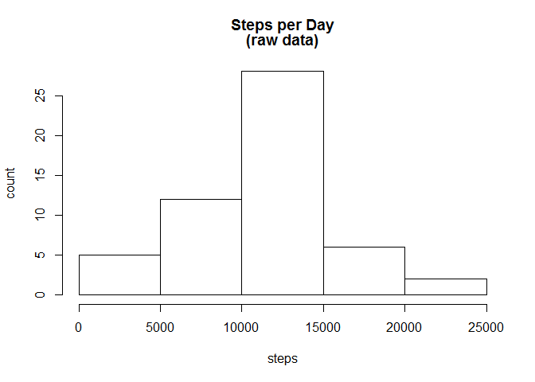
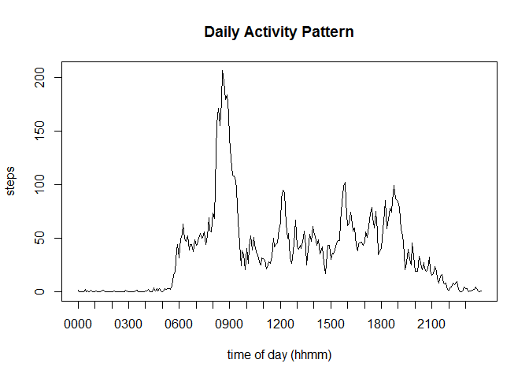
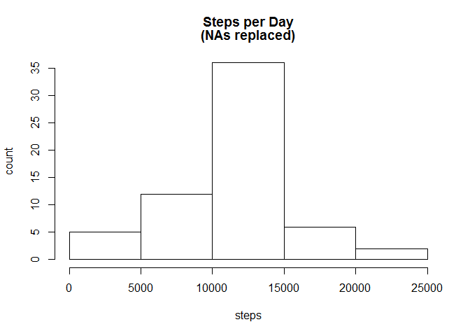
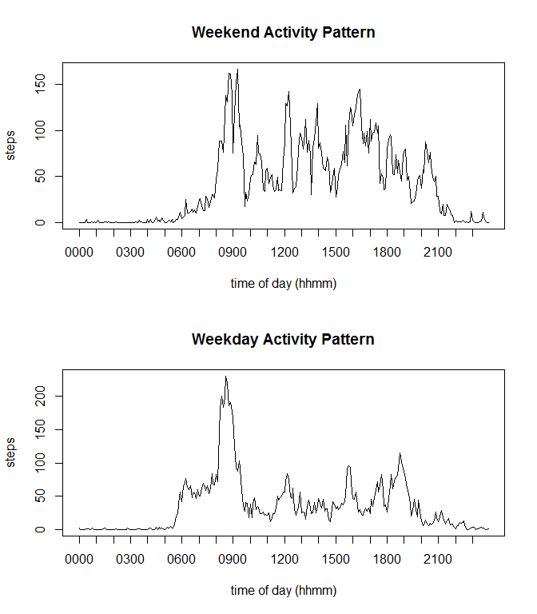

# Reproducible Research: Peer Assessment 1

## Loading and preprocessing the data


```r
csvFile <- "./activity.csv"
df1 <- read.csv(csvFile, colClasses=c("integer", "Date", "integer"), na.strings=c("NA"))
hhmm <- unique(sprintf("%04d", df1$interval)) # x-axis labels
```

## What is the mean number of steps taken per day?


```r
# calc mean & median
stepsPerDay1 <- aggregate(steps ~ date, df1, sum)
mean1 <- mean(stepsPerDay1$steps)
median1 <- median(stepsPerDay1$steps)
c(mean1=mean1, median1=median1)
```

```
##    mean1  median1 
## 10766.19 10765.00
```

```r
hist(stepsPerDay1$steps, main=c("Steps per Day", "(raw data)"), xlab="steps", ylab="count")
```

 

## What is the average daily activity pattern?


```r
dailyPattern <- aggregate(steps ~ interval, df1, mean)
plot(dailyPattern$steps, type="l", main="Daily Activity Pattern"
     , xlab="time of day (hhmm)", ylab="steps", xaxt="n"
)
sq <- seq(1, 288, 12)
axis(1, sq, hhmm[sq])
```

 

```r
# get the 5 minute interval with most steps
steps.max <- max(dailyPattern$steps)
ix <- which(dailyPattern$steps == steps.max)
c(max.hhmm=hhmm[ix])
```

```
## max.hhmm 
##   "0835"
```

## Imputing missing values


```r
#total number of missing values
(na.cnt <- sum(is.na(df1$steps)))
```

```
## [1] 2304
```

```r
# replace NAs with mean interval values
dfm <- merge(df1, dailyPattern, by=c("interval", "interval"))
df2 <- data.frame(
    steps = ifelse(is.na(dfm$steps.x), dfm$steps.y, dfm$steps.x)
    , date = dfm$date
    , interval = dfm$interval
)

# calc mean & median
stepsPerDay2 <- aggregate(steps ~ date, df2, sum)
mean2 <- mean(stepsPerDay2$steps)
median2 <- median(stepsPerDay2$steps)
c(mean2=mean2, median2=median2)
```

```
##    mean2  median2 
## 10766.19 10766.19
```

```r
# calc deltas
mean.delta <- mean2 - mean1
median.delta <- median2 - median1
c(mean.delta=mean.delta, median.delta=median.delta)
```

```
##   mean.delta median.delta 
##     0.000000     1.188679
```

The mean is unchanged because NAs, by design, were replaced with mean values. There is a small effect on median because there are now 2304 more values in the population.  More values changes the histogram counts upwards.


```r
hist(stepsPerDay2$steps, main=c("Steps per Day", "(NAs replaced)"), xlab="steps", ylab="count")
```

 

## Are there differences in activity patterns between weekdays and weekends?


```r
# split dataset into weekend and weekday days
dayClass <- factor(ifelse(weekdays(df2$date) %in% c("Saturday", "Sunday"), "weekend", "weekday"))
df3 <- split(df2, dayClass)

# aggregate split datasets
dailyPattern.weekend <- aggregate(steps ~ interval, df3$weekend, mean)
dailyPattern.weekday <- aggregate(steps ~ interval, df3$weekday, mean)

# plot split datasets
par(mfrow=c(2,1)) 

plot(dailyPattern.weekend$steps, type="l", main="Weekend Activity Pattern"
     , xlab="time of day (hhmm)", ylab="steps", xaxt="n"
)
sq <- seq(1, 288, 12)
axis(1, sq, hhmm[sq])

plot(dailyPattern.weekday$steps, type="l", main="Weekday Activity Pattern"
     , xlab="time of day (hhmm)", ylab="steps", xaxt="n"
)
axis(1, sq, hhmm[sq])
```

 


